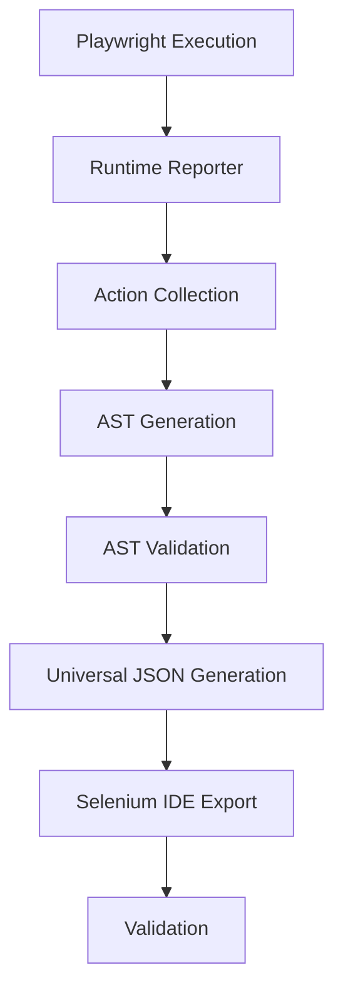

# SpeedPlay Runtime Engine — Architecture Document

## Subsystem Architecture

```text
┌─────────────────────────────────────────────────────────────────────┐
│                   SPEEDPLAY RUNTIME ENGINE                          │
│                                                                     │
│  ┌───────────────────┐    ┌─────────────────┐    ┌───────────────┐  │
│  │Playwright Runner  │───▶│ Runtime Reporter│───▶│ Action        │  │
│  │(.spec.js + POM)   │    │  (Hooks)        │    │ Collector     │  │
│  └───────────────────┘    └─────────────────┘    └───────┬───────┘  │
│           │                                              │          │
│           ▼                                              ▼          │
│  ┌───────────────────┐                           ┌───────────────┐  │
│  │    HTML Report     │                           │ AST Builder   │  │
│  │  + Screenshots     │                           │               │  │
│  │  + JSON Results    │                           └───────┬───────┘  │
│  └───────────────────┘                                   │          │
│                                                          ▼          │
│                                                  ┌───────────────┐  │
│                                                  │Universal JSON │  │
│                                                  │Generator      │  │
│                                                  └───────┬───────┘  │
│                                                          │          │
│                                                          ▼          │
│                                                  ┌───────────────┐  │
│                                                  │ Selenium IDE  │  │
│                                                  │ Exporter      │  │
│                                                  │ (.side)       │  │
│                                                  └───────────────┘  │
└─────────────────────────────────────────────────────────────────────┘
```

## Data Flow



## Component Responsibilities

| Component | Responsibility |
|-----------|---------------|
| **Playwright Runner** | Actual test execution engine using Microsoft Playwright |
| **Runtime Reporter** | Intercepts Playwright steps in real-time |
| **Action Collector** | Extracts and normalizes raw interactions from Runtime Reporter |
| **AST Builder** | Constructs Abstract Syntax Tree from extracted actions |
| **AST Validator** | Validates structural integrity of generated AST |
| **Universal JSON Generator** | Transforms AST into intermediate Universal JSON mapping |
| **Selenium IDE Exporter** | Converts Universal JSON into target `.side` file structure |
| **Reporting Layer** | Outputs standard Playwright reports (HTML, JSON, traces) |
| **Validation Layer** | Ensures strict pipeline consistency end-to-end |

## Directory Map

```
automation/
├── ast/                 # Abstract Syntax Tree layer
│   ├── node-types.js
│   ├── builder.js
│   └── validator.js
├── docs/                # Architecture & Strategy
│   ├── testing-pakar-air.md
│   └── architecture.md
├── exporters/           # Exporter layer
│   ├── base-exporter.js
│   ├── selenium-ide.exporter.js
│   └── index.js
├── output/              # Runtime Output
│   ├── json/            
│   ├── selenium/        
│   └── reports/         
├── parser/              # SpeedPlay Runtime Parsing Core
│   ├── action-extractor.js
│   ├── raw-action-mapper.js
│   ├── transformer.js
│   └── reporter.js      
├── playwright/          # Microsoft Playwright Test Assets
│   ├── data/            
│   ├── fixtures/        
│   ├── helpers/         
│   ├── locators/        
│   ├── pages/           
│   └── tests/           
├── schemas/             # Architecture Schemas
│   ├── universal-test.schema.json
│   └── action-types.js
├── screenshots/         
├── test-data/           
├── package.json
├── playwright.config.js
├── generate-master-doc.js
└── README.md
```
